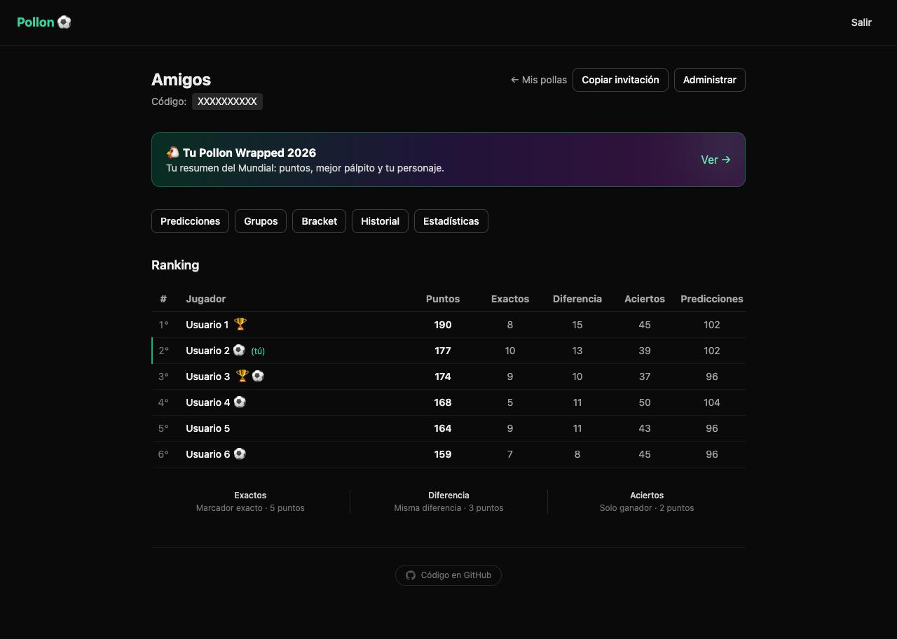
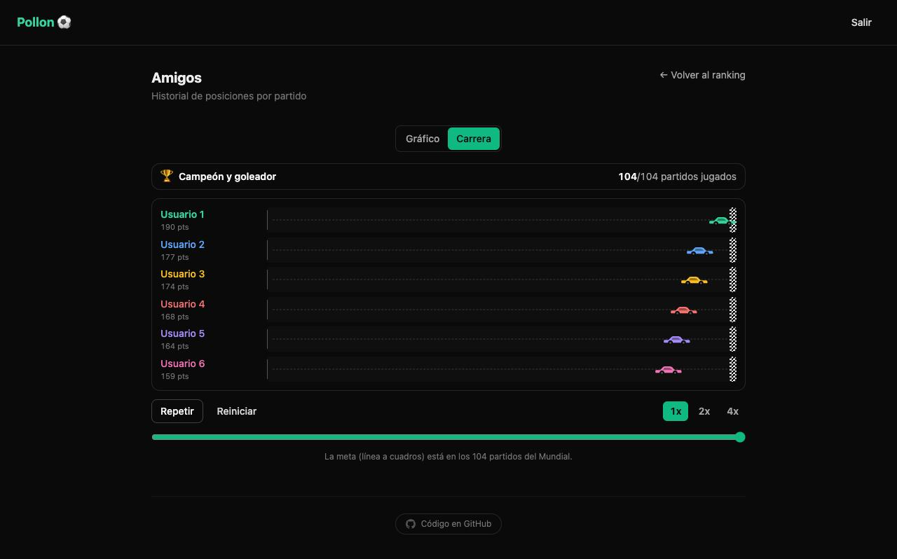
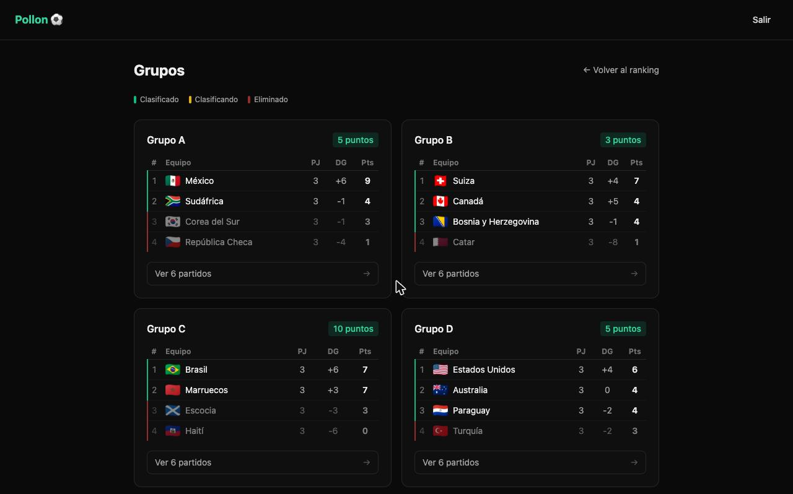
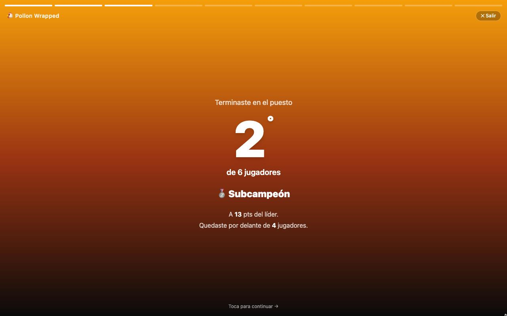

# Pollon ⚽

[](https://github.com/ivanvlam/pollon/actions/workflows/ci.yml)

Polla del Mundial 2026 (quiniela) para grupos privados de amigos: predices el marcador de cada partido, la app los puntúa automáticamente al terminar y el ranking se actualiza en vivo.

**🔗 Demo:** https://pollon-nine.vercel.app

> Los nombres y el código de invitación de las capturas están reemplazados por datos de ejemplo; los puntajes son reales.



<table>
  <tr>
    <td width="50%"></td>
    <td width="50%"></td>
  </tr>
  <tr>
    <td align="center"><em>La carrera del historial: cómo se movieron las posiciones</em></td>
    <td align="center"><em>Fase de grupos con tablas estilo FIFA</em></td>
  </tr>
</table>



## Qué es

Cada grupo juega en su propia polla, cerrada por código de invitación. Se predice el marcador de los 104 partidos: marcador exacto son 5 puntos, acertar la diferencia de goles 3, solo el ganador 2. En eliminatorias no se suma nada sin acertar quién clasifica. Aparte se elige campeón y goleador del torneo, que quedan sellados poco después del partido inaugural.

Las predicciones ajenas no se ven hasta que el partido cierra, una hora antes del kickoff. Tanto el cierre como la visibilidad se aplican con RLS y funciones `SECURITY DEFINER` en la base de datos, no en el frontend.

El código de la app es público; las pollas no.

## Cómo fue

El primer commit es del 3 de junio de 2026 y el Mundial debutaba el 11: ocho días para llegar con lo mínimo funcionando (predecir, puntuar, ranking). El resto se construyó con el torneo ya en marcha, y ahí está la mayor parte del trabajo: 231 de los 319 commits son de esas seis semanas.

Sobre la marcha se fueron sumando vistas que no estaban en la versión inicial: el **historial** partido a partido, con una animación de carrera que muestra cómo se movieron las posiciones a lo largo del torneo; las **estadísticas** de la polla (precisión, rachas, promedio por partido); y el **perfil de cada jugador** con sus predicciones ya reveladas.

Otros cambios salieron de casos que solo aparecen jugando:

- **Marcador a los 90'.** Con los primeros alargues, el marcador de cancha pisaba el del tiempo reglamentario, que es el que se puntúa. Hubo que congelarlo y darle memoria (`reached_extra_time`), porque el proveedor no siempre marcaba el cierre como alargue.
- **Cruces de eliminatoria.** El proveedor los publicaba con retraso, así que se agregó carga manual desde el panel de admin más una reconciliación que re-keya la fila cuando la API finalmente publica el partido, para no duplicarlo ni dejar predicciones huérfanas.

El 19 de julio terminó el torneo, con España 1-0 Argentina en la final y Mbappé como goleador. Ese mismo día se publicó el **Pollon Wrapped**: un resumen de fin de torneo en formato de stories que arma el "personaje" de cada jugador a partir de sus estadísticas.

La app quedó en modo archivo: el ranking final, el historial y el Wrapped siguen disponibles, pero ya no hay predicciones abiertas. Para reutilizarla en otro torneo hay que rehacer el fixture, los planteles (`src/lib/players-data.ts`) y reactivar los cron jobs.

## Características

- **Predicciones por partido** con guardado automático (debounce de 500 ms, sin botón de enviar). Cada partido cierra **1 hora antes de su propio inicio**, validado en la base de datos (no solo en el frontend).
- **Predicciones globales:** la misma predicción cuenta en todas las pollas en las que participas; al unirte a mitad de torneo se hace *backfill* de tus puntos en los partidos ya jugados.
- **Puntuación excluyente** (se aplica solo el nivel más alto): en grupos 5/3/2 (marcador exacto / misma diferencia de goles / acierto de resultado); en eliminatorias igual, pero **condicionado a acertar el clasificado**. Además **+15** por el campeón y **+10** por el goleador del torneo (ambos se cierran 2h después del inicio del primer partido).
- **Marcador a los 90':** en eliminatorias se puntúa el resultado del tiempo reglamentario, no el de cancha. El cron congela el marcador a los 90' en cuanto el partido pasa a alargue o penales, así que puedes predecir 1-1 y que igual clasifique tu equipo.
- **Seguimiento en vivo:** estado del partido, marcador y **animación de gol** (pelota, "GOOOL" y confeti con los colores del equipo) durante los partidos.
- **Ranking por polla** con desempates por criterios reales (exactos → misma diferencia → aciertos → campeón), sin desempate alfabético, mostrando la razón de cada puntaje.
- **Vistas de la polla:** fase de grupos, **bracket eliminatorio** (incluye el partido por el tercer lugar), **historial** partido a partido con una animación de "carrera de autos" que muestra cómo se movieron las posiciones, **estadísticas** (precisión, rachas, promedio por partido) y **perfil de cada jugador** con todas sus predicciones reveladas.
- **Pollon Wrapped:** resumen de fin de torneo estilo Spotify Wrapped, en formato de stories. Elige un "personaje" según tus estadísticas (aciertos, racha, mejor pálpito) y se habilita recién cuando el torneo terminó del todo: campeón y goleador definidos.
- **Pollas privadas** por código de invitación. El creador administra la polla (renombrar, expulsar miembros, eliminar mientras no haya puntos registrados); cualquier participante puede **abandonarla** por su cuenta (el creador no, para eso elimina la polla). No se puede unir después de la final.
- **Panel de admin** global (único `ADMIN_EMAIL`): estadísticas, gestión de pollas/usuarios, activación manual de rondas eliminatorias, carga manual de cruces de eliminatoria, carga de resultados y marcado de campeón/goleador reales.
- **GDPR:** página de privacidad para usuarios de Europa.

## Stack

- **Framework:** Next.js 14 (App Router, Server Components, Server Actions)
- **Base de datos y auth:** Supabase (Postgres + RLS + Auth). La visibilidad de predicciones ajenas y los cierres se aplican con **RLS** y funciones `SECURITY DEFINER`, no solo en el cliente.
- **UI:** Tailwind CSS con tokens propios, componentes shadcn/Radix (diálogos accesibles) y toasts con Sonner
- **Hosting:** Vercel (con Vercel Analytics)
- **Cron jobs:** [cron-job.org](https://cron-job.org) llamando a los endpoints `/api/cron/*` protegidos con `CRON_SECRET`
- **Emails:** Resend (recordatorios de cierre, escritos pero nunca activados; ver más abajo)
- **Datos del Mundial:** TheSportsDB (fixtures y resultados; cliente alternativo para [football-data.org](https://www.football-data.org) preparado como *drop-in*, ver `src/lib/football-data.ts`)
- **Planteles:** datos estáticos (planteles oficiales FIFA 2026, 48 equipos) cargados vía RPC
- **Lenguaje:** TypeScript estricto en todo el proyecto
- **Tests:** Vitest sobre la lógica pura de negocio (puntuación, standings, timing, desempates, marcador a 90', carrera del historial)

## Setup local

```bash
cp .env.example .env.local
# Completar variables en .env.local
npm install
npm run dev          # http://localhost:3000
```

## Variables de entorno

Ver `.env.example` para la lista completa. Las obligatorias antes del deploy:

| Variable | Descripción |
|----------|-------------|
| `NEXT_PUBLIC_SUPABASE_URL` | URL del proyecto Supabase |
| `NEXT_PUBLIC_SUPABASE_ANON_KEY` | Clave pública (`sb_publishable_*`) |
| `SUPABASE_SERVICE_ROLE_KEY` | Clave secreta de servidor (`sb_secret_*`). **Nunca** exponer al cliente |
| `ADMIN_EMAIL` | Email del único administrador de la app |
| `CRON_SECRET` | String aleatorio ≥ 16 chars para proteger los endpoints de cron |
| `THESPORTSDB_KEY` | Clave de TheSportsDB (la gratuita permite 30 req/min, sin tope diario) |
| `APP_URL` | URL pública de la app (la usan los emails de recordatorio) |
| `RESEND_API_KEY` | Opcional: recordatorios de cierre por email (nunca activados). Si falta, el envío es no-op |

> **Nota sobre las claves de Supabase:** el nuevo formato `sb_secret_*` no otorga el rol PostgreSQL `service_role` vía PostgREST. Para operaciones con privilegios elevados se usan funciones `SECURITY DEFINER` en la DB.

## Comandos

```bash
npm run dev          # servidor local (http://localhost:3000)
npm run build        # build de producción
npm run start        # servir el build de producción
npm run typecheck    # verificación de tipos (tsc --noEmit)
npm run test         # tests unitarios (Vitest)
npm run test:watch   # tests en modo watch
npm run lint         # ESLint
npm run db:types     # regenerar tipos desde la DB local (requiere Supabase CLI)
```

## Estructura

```
src/
├── app/
│   ├── (auth)/                 # login y registro
│   ├── (app)/                  # rutas protegidas (requieren sesión)
│   │   ├── dashboard/          # mis pollas
│   │   ├── admin/              # panel global de admin
│   │   ├── champion/           # campeón y goleador del torneo
│   │   ├── como-funciona/      # reglas y puntuación
│   │   ├── pools/nueva/        # crear polla
│   │   ├── join/[code]/        # unirse por link de invitación
│   │   └── pool/[id]/          # ranking, predicciones, grupos, bracket,
│   │                           # historial, estadísticas, player/[userId],
│   │                           # wrapped, manage
│   ├── privacy/                # política de privacidad (GDPR)
│   └── api/
│       ├── cron/               # sync-matches, lock-predictions, calculate-scores
│       ├── notifications/      # send-reminders
│       └── team/[team]/        # datos de equipo
├── components/                 # UI y componentes de la app
├── lib/                        # lógica de dominio (scoring, timing, wrapped, race,
│                               # supabase, y dominios por carpeta)
└── types/                      # tipos TypeScript de la DB
supabase/migrations/            # esquema y funciones versionadas (SQL)
```

## Migraciones

Las migraciones viven en `supabase/migrations/`. Aplicar en el SQL editor del dashboard de Supabase, con `supabase db query` o con `supabase db push` si tienes la CLI configurada.

> ⚠️ En Postgres, exponer una tabla a la app necesita **dos** cosas: la policy de RLS *y* el `GRANT` de tabla. Si falta el `GRANT`, las lecturas fallan con `permission denied` aunque la policy sea correcta.

## Cron jobs

Los endpoints `/api/cron/*` verifican el header `Authorization: Bearer ${CRON_SECRET}` antes de ejecutar. Los disparaban tareas en [cron-job.org](https://cron-job.org). **Con el torneo terminado ya no hacen trabajo útil** y se pueden pausar.

| Endpoint | Frecuencia | Qué hace |
|----------|------------|----------|
| `sync-matches` | Cada 1 min | Sincroniza fixture y resultados desde TheSportsDB. *Smart windowing:* no llama a la API fuera de las ventanas de partido, así que 0 requests cuando no hay nada en juego. Cada 15 min hace además una pasada de descubrimiento de cruces de eliminatoria. |
| `lock-predictions` | Cada hora | Marca `is_locked` y gestiona el cierre de campeón/goleador |
| `calculate-scores` | Bajo demanda | Recalcula los puntos de un partido terminado (también se dispara solo cuando el sync detecta el cambio a `finished`) |

> ⏳ **Nunca activado:** `send-reminders` (recordatorios de cierre por email vía Resend). La lógica está escrita (busca los partidos que cierran en las próximas 2h y deduplica con la tabla `sent_reminders`), pero nunca se le configuró un cron ni se verificó el dominio en Resend, así que en todo el torneo no envió un solo email.

En `.github/workflows/` quedan workflows equivalentes como alternativa; el de `sync-matches` y el de `send-reminders` están en modo manual (`workflow_dispatch`), y el de `lock-predictions` conserva un cron horario que conviene desactivar ahora que el torneo cerró.

## Licencia

[MIT](./LICENSE)
